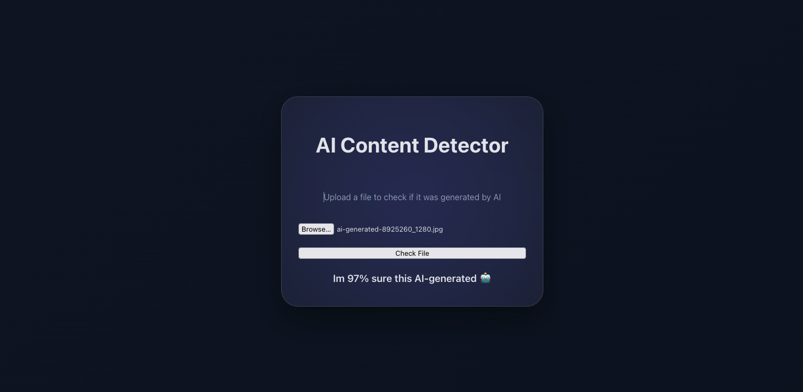

random pull request
# 🤖 vs 🎨 AI or Human Image Detector


**Detect whether an image was created by AI or a human photographer with cutting-edge deep learning technology.**



---

## ✨ **Why This Project?**

In an era where AI-generated content is becoming indistinguishable from human-created work, this project provides a powerful tool to:

- **Verify image authenticity** for journalists, researchers, and content creators
- **Educate** about AI-generated content
- **Enhance trust** in digital media
- **Explore** the capabilities of deep learning in image classification

This repository combines a **production-ready API** with a **modern web interface**, making it accessible for both developers and end-users.

---

## 🛠️ **Tech Stack**

| Category       | Technologies Used                        |
| -------------- | ---------------------------------------- |
| **Backend**    | Python, PyTorch, Flask, TorchVision      |
| **Frontend**   | Next.js, React, TypeScript, Tailwind CSS |
| **Model**      | ResNet-18 (custom fine-tuned)            |
| **Deployment** | Local (Flask), Web (Next.js)             |

### **System Requirements**

- Python 3.8+
- PyTorch 2.0+
- CUDA (optional, for GPU acceleration)
- Node.js 18+ (for frontend)

---

## 📦 **Installation**

### **Prerequisites**

Ensure you have the following installed:

- Python 3.8+
- Node.js 18+
- Git

### **Quick Start (Backend + Frontend)**

#### **1. Clone the Repository**

```bash
git clone https://github.com/David1DDT/ai-or-human-image-detector.git
cd ai-or-human-image-detector
```

#### **2. Set Up the Backend (Python)**

```bash
# Create and activate a virtual environment (recommended)
python -m venv venv
source venv/bin/activate  # On Windows: venv\Scripts\activate

# Install dependencies
pip install torch torchvision flask pillow
```

#### **3. Set Up the Frontend (Next.js)**

```bash
cd client
npm install
```

#### **5. Run the Backend**

```bash
cd ..
python server/main.py
```

The API will be available at `http://127.0.0.1:5000`.

#### **6. Run the Frontend**

```bash
cd client
npm run dev
```

The web interface will be available at `http://localhost:3000`.

---

## 🎯 **Usage**

### **Basic API Usage**

Send a POST request to `/api/predict` with an image file:

```bash
curl -X POST -F "image=@test_image.jpg" http://127.0.0.1:5000/api/predict
```

**Response:**

```json
{
  "prediction": "real",
  "confidence": 0.9876
}
```

### **Web Interface**

1. Upload an image via the Next.js frontend.
2. Click **"Check File"** to analyze the image.
3. View the result (e.g., _"I'm 98% sure this is AI-generated 🤖"_).

---

## 📁 **Project Structure**

```
ai-or-human-image-detector/
│
├── server/                  # Backend API (Flask + PyTorch)
│   ├── main.py              # Flask API routes
│   ├── predict.py           # Model prediction logic
│   └── ai_vs_real.pth       # Pre-trained model (required)
│
├── client/                  # Frontend (Next.js + React)
│   ├── app/                 # Next.js app directory
│   ├── package.json         # Frontend dependencies
│   └── globals.css          # Tailwind CSS styles
│
├── README.md                # This file
└── LICENSE                  # MIT License
```

---

## 🔧 **Configuration**

### **Environment Variables**

No environment variables are required for basic usage. For production, consider:

- Setting `FLASK_ENV=production` for the backend.
- Configuring CORS in Flask for cross-origin requests.

### **Customizing the Model**

The model is loaded from `server/ai_vs_real.pth`. To replace it:

1. Train a new model.
2. Place the `.pth` file in the `server/` directory.

---

## 🤝 **Contributing**

We welcome contributions! Here’s how you can help:

### **1. Development Setup**

```bash
# Clone the repo and set up both backend and frontend
git clone https://github.com/David1DDT/ai-or-human-image-detector.git
cd ai-or-human-image-detector

# Backend
python -m venv venv
source venv/bin/activate
pip install -r requirements.txt  # (Add a requirements.txt later)

# Frontend
cd client
npm install
```

### **2. Code Style Guidelines**

- **Backend (Python):** Follow [PEP 8](https://peps.python.org/pep-0008/) guidelines.
- **Frontend (TypeScript/React):** Use TypeScript for type safety and React best practices.
- **Commit Messages:** Follow [Conventional Commits](https://www.conventionalcommits.org/).

### **3. Pull Request Process**

1. Fork the repository.
2. Create a feature branch (`git checkout -b feature/your-feature`).
3. Commit your changes (`git commit -m "Add new feature"`).
4. Push to the branch (`git push origin feature/your-feature`).
5. Open a Pull Request!

## 🔄 **Training Your Own Model**

If you want to train a custom model:

1. **Prepare a dataset** of AI-generated and human-generated images.
2. **Modify `server/predict.py`** to load your dataset and fine-tune the ResNet-18 model.
3. **Save the trained model** as `ai_vs_real.pth` in the `server/` directory.

## 📝 **License**

This project is licensed under the **MIT License**. See the [LICENSE](LICENSE) file for details.

---

## 👥 **Authors & Contributors**

**Maintainer:**[ David Dumitru](https://github.com/David1DDT)

**Special thanks to:**

- The PyTorch and Flask communities for their incredible tools.
- Open-source enthusiasts for inspiring this project.

## 🐛 **Issues & Support**

### **Reporting Issues**

Found a bug or have a feature request? Open an issue on GitHub with:

- A clear description of the problem.
- Steps to reproduce (if applicable).
- Screenshots or logs (if relevant).

### **Getting Help**

- **Discussions:** Ask questions in the [GitHub Discussions](https://github.com/David1DDT/ai-or-human-image-detector/discussions) tab.
- **Community:** Join our [Discord](https://discord.gg/your-invite-link) for real-time support.

### **FAQ**

**Q: Can I use this for commercial purposes?**
A: Yes! This project is licensed under MIT, allowing commercial use.

**Q: How accurate is the model?**
A: Accuracy depends on the quality of the pre-trained model (`ai_vs_real.pth`). For best results, train on a diverse dataset.

**Q: Does it support video?**
A: No, this project currently focuses on **static images**. Video support is planned for future updates!

---

## 🗺️ **Roadmap**

| Feature                | Status   | Description                                  |
| ---------------------- | -------- | -------------------------------------------- |
| **Video Support**      | Planned  | Extend to detect AI vs. human video content. |
| **Batch Processing**   | Planned  | Analyze multiple images at once.             |
| **Mobile App**         | Proposal | iOS/Android app for on-the-go detection.     |
| **Model Improvements** | Ongoing  | Fine-tune with larger datasets.              |

---

## 🚀 **Get Started Today!**

Ready to explore AI vs. human image detection? Star this repository and contribute to the future of digital authenticity!

```bash
git clone https://github.com/David1DDT/ai-or-human-image-detector.git
cd ai-or-human-image-detector
python server/main.py  # Backend
cd client && npm run dev  # Frontend
```

Now visit `http://localhost:3000` and upload an image to see the magic happen! 🎨🤖
